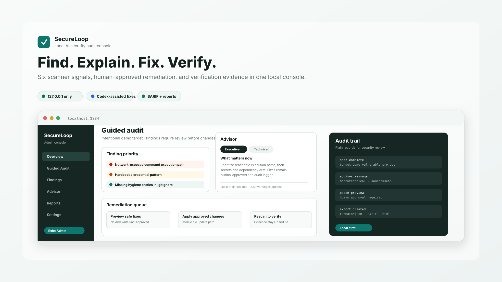

# SecureLoop



> **AI cybersecurity console — built with Codex, on a leash.**
> Find risk in 6 dimensions · Approve every fix in plain English · Verify it actually worked.

[](CONTEXT/Shared/CHANGELOG.md)
[](LICENSE)
[](#)
[](#)

AI-powered cybersecurity audit software for OpenClaw skills, project folders,
and local machine posture. SecureLoop scans for malware patterns, hardcoded
secrets, vulnerable dependencies, suspicious permissions, risky network
exposure, and fixable hygiene gaps before code runs on your system.

What makes it different: SecureLoop does not stop at finding problems. It can
preview deterministic safe fixes, draft AI-assisted patches for human approval,
apply approved changes, and then rescan the target to verify the vulnerability
or hygiene issue is actually gone.

**v1.3 highlights**: AI Advisor as a first-class scan-aware chat assistant,
four-tier RBAC (Admin / Operator / Auditor / Viewer) with delegated tokens,
light + dark themes, configurable AI provider (OpenAI or fully-local Ollama),
Slack / Teams / generic webhooks on critical findings, and a one-click
"Export everything" for backup or SIEM ingest. See `CONTEXT/Shared/CHANGELOG.md`
for the full release notes.

**Local-first by default.** The dashboard binds to `127.0.0.1` only.
Nothing leaves your computer unless you explicitly turn on the OpenAI
provider (bring-your-own-key) or a notification webhook. v1.4 will add
fleet auditing (audit any computer from anywhere over a tunneled agent)
without breaking that property — see DECISION-047 in `CONTEXT/Shared/DECISIONS.md`.

The dashboard also includes **SecureLoop Advisor**, a floating scan-aware chat
assistant with Executive, Technical, and Remediation modes. Its security
judgment comes from SecureLoop's own local Advisor Brain: intent detection,
risk priority, allowed actions, and evidence are deterministic. Local or
OpenAI models can polish wording, but they do not decide what is true or what
actions are allowed.
By default Advisor uses local scan data and will use free local Ollama AI when
Ollama is running. For stronger prompt interpretation, use the OpenAI-backed
Advisor path with `SECURELOOP_ADVISOR_PROVIDER=openai` and `OPENAI_API_KEY`.
No execution: free-form chat will not silently apply fixes or change policy.

Free local AI option:

```bash
ollama pull llama3.1:8b
ollama serve
npm start
```

Optional environment variables:

```bash
SECURELOOP_ADVISOR_PROVIDER=ollama
SECURELOOP_OLLAMA_MODEL=llama3.1:8b
SECURELOOP_ADVISOR_PROVIDER=openai
SECURELOOP_ADVISOR_MODEL=gpt-5.3-codex
SECURELOOP_ADVISOR_AI=true
OPENAI_API_KEY=...
```

Create a local `.env` file for real keys. `.env` is ignored by git; do not put
API keys in source files, docs, screenshots, or commits.

SecureLoop is OpenAI-first: Codex can serve as the remediation brain through
the OpenAI Responses API, drafting minimal patches that SecureLoop validates
before a human approves them.

SecureLoop is an ongoing cybersecurity product by Jorge Elizalde. The current
build is competition-ready for the OpenAI x Handshake Codex Creator Challenge,
but the project is designed to keep evolving after that milestone.

## Quick Start

```bash
git clone https://github.com/elizaldejorge/secureloop.git
cd secureloop
npm install
npm test                # syntax-checks all modules
npm start               # opens http://localhost:3334
```

That's the entire onboarding for the dashboard. To run a one-shot scan
from the command line instead:

```bash
node test.js clawsaver
node test.js /path/to/project
node test.js system
node test.js --dashboard
```

Targets can be an installed OpenClaw skill name, a local folder path, or
`system` for privacy-preserving local posture checks.

AI Review Patches use `OPENAI_API_KEY` (or configure it in
`Settings → AI Provider`, which persists it server-side and masks it on
read).

## Guided Audit

The dashboard includes a harmless target at `./demo-vulnerable-project`. Click
**Guided Audit** from the overview page to see the full audit flow:

1. Scan the intentionally weak sample project.
2. Open Details to see a plain-English summary and technical evidence.
3. Ask Advisor to explain the scan in Executive or Technical mode.
4. Preview fixes without writing to disk.
5. Apply only safe deterministic fixes.
6. Let SecureLoop automatically rescan and compare before/after risk.
7. Export a Scan Report or SARIF file from **Reports & Export**.

This demo is intentionally vulnerable and contains only fake sample data.

## Easy Launch

On macOS, open `SecureLoop.command` from this folder. It checks for Node.js,
installs dependencies if needed, and starts the dashboard at
`http://localhost:3334`.

## Roles & Access (v1.3)

SecureLoop uses a four-tier role model:

| Role | What they can do |
|------|------------------|
| **Admin**    | Manage PIN, mint/revoke role tokens, edit policy, manage block/whitelist, apply autofix. |
| **Operator** | Run scans, propose patches, apply approved autofixes. Cannot manage roles or change policy. |
| **Auditor**  | Read everything, run scans, export reports (CSV / JSON / SARIF / HTML). No fix application. |
| **Viewer**   | Read-only: scans, findings, patches, audit log, reports. Cannot trigger any action. |

The master PIN logs you in as **Admin**. Lower roles are accessed via
delegated tokens that admins issue from `Settings → Roles & Access`.
Tokens are role-scoped, time-bound, and shown exactly once. The pattern
follows Vault dynamic secrets, AWS STS, and GitHub fine-grained PATs.

Every privileged route is guarded server-side by an explicit
`requireRole(min)` middleware — UI gating is purely cosmetic.

## Notifications (v1.3)

`Settings → Notifications` configures a webhook (Slack incoming-webhook,
Microsoft Teams MessageCard, or generic JSON). When a scan produces
findings at or above your chosen min severity, SecureLoop fires a
non-blocking webhook with the headline, score, and a short summary of
the worst findings. Off by default for offline use. There's a
"Send test ping" button so you can verify the wire-up before relying
on it.

## Roadmap — v1.4 SecureLoop Mesh / Fleet

Audit any computer from anywhere, with credentials, without ever
opening an inbound port on the audited machine. The pattern: each host
runs a small `secureloop-agent` that dials *out* over an encrypted
WebSocket to a SecureLoop relay; a single web console pages those
agents through the relay; the same v1.3 RBAC tokens carry per-host
scope ("auditor on host laptop-01 only"); scan output is end-to-end
encrypted between agent and console — the relay only sees ciphertext.
Full design in `CONTEXT/Shared/DECISIONS.md` DECISION-047.
